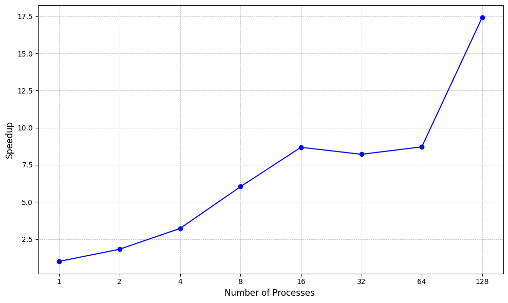

# Parallel Bitonic Sort using MPI

Sorting algorithms usually take $O(nlogn)$ time to sort an array of size n. Bitonic sort is a parallel sorting 
algorithm that can sort very large arrays faster with the power of MPI and parallel processing.

The algorithm follows the standard Bitonic Sort Network pattern as shown below. More info about the implementation can be
found in the [report](documentation/report.pdf).


## How to run
1. Clone the repository
```bash
git clone git@github.com:NontasBak/parallel-bitonic-sort.git
```
2. Change your active directory
```bash
cd parallel-bitonic-sort/src/mpi/
```
3. Compile the code using `make`. You might need to install `mpicc` if you haven't already.
4. Run the code
```bash
make run
```
5. Remove the executables after running
```bash
make clean
```

In order to change the number of elements per process and the number of processes, you can modify the
variables `num_q` and `num_p` inside the `main` function.

## Benchmarks

The following benchmarks were run on the [Aristotel Cluster](https://hpc.it.auth.gr/) on the `rome` and `batch` partitions.
The specs can be found [here](https://hpc.it.auth.gr/nodes-summary/).

### Execution time with different number of processes (2^27 elements per process)


### Speedup compared to QuickSort (2^27 elements total)


### Execution time using different number of nodes (128 processes)


### Authors

Eleni Koumparidou and Epameinondas Bakoulas

Class: Parallel and Distributed Systems with professor Nikolaos Pitsianis

January 2025

